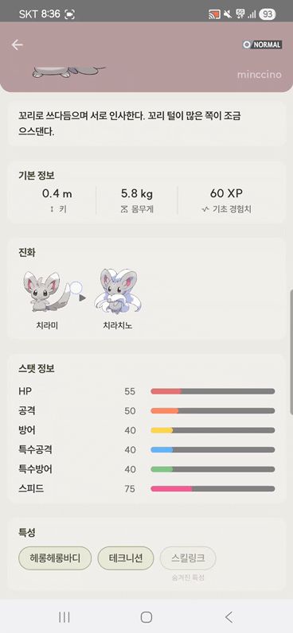
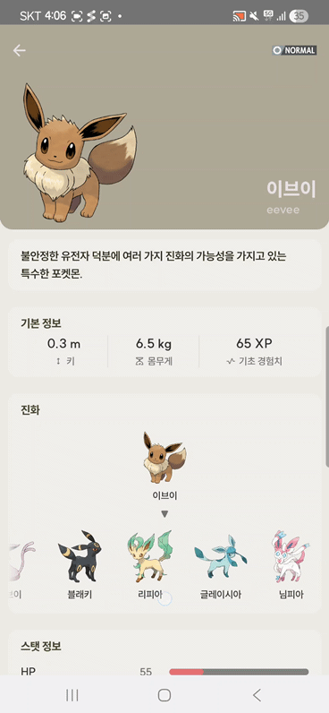

# 포켓몬도감 ⚡️

> PokeAPI 기반 포켓몬 도감 안드로이드 앱 — 클린 아키텍처 학습용 개인 프로젝트

본 프로젝트는 배포용이 아닌 **공부용**으로, 멀티모듈 클린 아키텍처와 최신 Jetpack 스택을 직접 적용해 보는 것이 목적입니다.
테드박님의 [MovieApplication](https://github.com/tedb-org/MovieApplication) 클린 아키텍처 구조를 참고하여 설계했습니다.

---

## 📸 스크린샷

### 포켓몬 목록
|                          Light                           | Dark |
|:--------------------------------------------------------:|:---:|
|  |  |

### 포켓몬 상세
|                          Light 1                           |                           Light 2                            | Dark |
|:----------------------------------------------------------:|:------------------------------------------------------------:|:---:|
|  |  |  |

  
   
  Collapsing AppBar 애니메이션

### 진화 체인
| 기본 화면 |                             스크롤 시                              |
|:---:|:--------------------------------------------------------------:|
|  |  |

### 검색
|                           Light                            | Dark |
|:----------------------------------------------------------:|:---:|
|  |  |

---

## 🎯 학습 목표

이 프로젝트를 통해 익히고자 한 것들입니다.

- **멀티모듈 클린 아키텍처** — `presentation → domain ← data` 의존성 흐름을 모듈 단위로 강제
- **순수 Kotlin 도메인 모듈** — 안드로이드 의존성 없이 비즈니스 로직 분리
- **Paging 3 + Room** — 페이지네이션과 로컬 캐시 동시 적용
- **Jetpack Compose UI** — Collapsing Toolbar, 상태 기반 화면 분기, 애니메이션
- **Hilt 모듈 분리** — Network / Repository / DataSource(Local·Remote) / Sound 모듈을 책임 단위로 구성
- **KAPT → KSP 전환** — 빌드 속도 개선
- **Palette 기반 동적 컬러** — 포켓몬 이미지에서 추출한 색상으로 UI 톤 매칭

---

## ✨ 주요 기능

- 포켓몬 목록 무한 스크롤 (Paging 3 + Room 캐시)
- 이름 기반 검색
- 상세 화면: 기본 정보 / 능력치 / 어빌리티(한글 설명) / 진화 체인 / 울음소리 재생
- Collapsing AppBar + 포켓몬 이미지 기반 동적 컬러 적용
- 로딩 / 에러 / 빈 상태 화면 분기
- 데이터 누락 시 카드 자동 숨김 (설명, 울음소리 등)

---

## 🏗 아키텍처

**의존성 규칙**

- 모든 레이어가 `domain`을 향해 의존합니다.
- `data`는 `domain`의 Repository 인터페이스를 구현하며, 안드로이드/프레임워크 의존성은 `domain`에 침투하지 않습니다.
- `app` 모듈은 Hilt로 전체 모듈을 조립하는 진입점이며, `common` · `dataresource`는 공용 유틸 / 결과 래퍼로 모든 레이어에서 참조됩니다.

| 모듈 | 역할 |
|---|---|
| `app` | DI 설정 (Hilt 모듈), Application 진입점 |
| `ui` | Compose 화면 (목록 / 상세 / 검색 / 공통 컴포넌트) |
| `presentation` | ViewModel, UI State |
| `domain` | UseCase, Repository 인터페이스 (순수 Kotlin) |
| `data` | Repository 구현, DTO ↔ Domain 매퍼 |
| `remote` | Retrofit API 정의, Remote DataSource |
| `local` | Room DB, DAO, Local DataSource |
| `dataresource` | `DataResource<T>`, `AppError` 등 결과 래퍼 |
| `common` | 공통 유틸 / 상수 |

---

## 🛠 기술 스택

| 분류 | 사용 라이브러리 |
|---|---|
| Language | Kotlin 2.1.0 |
| UI | Jetpack Compose, Material3, Navigation Compose |
| Async | Kotlin Coroutines |
| DI | Hilt (Dagger 2.57.2) |
| Network | Retrofit 2.11, OkHttp 4.12, Gson |
| Local DB | Room 2.8.4 |
| Paging | Paging 3.3.6 |
| Image | Coil 3 (compose / gif / network-okhttp) |
| Animation | Lottie Compose 6.4 |
| Color | AndroidX Palette |
| Media | Android `MediaPlayer` (울음소리 재생) |

---

## 📝 배운 점 / 트러블슈팅

- **Paging 3 + Room 조합**: RemoteMediator 없이 Room을 단순 캐시로 쓸 때 invalidate 타이밍 이슈
- **모듈 간 모델 분리**: Remote DTO, Local Entity, Domain Model을 분리하면서 매퍼 코드가 많아지지만, 각 레이어의 변경 영향을 격리할 수 있다는 장점
- **Compose에서 동적 컬러**: Palette로 추출한 색상의 대비(contrast)에 따라 텍스트 색을 분기 처리해야 가독성 확보
- **ImageLoader 싱글톤화**: 여러 화면에서 같은 DB를 반복 구독하는 문제를 해결
- **KSP 전환**: KAPT 대비 빌드 시간 단축 체감

---

## 🤖 AI 협업 노트

본 프로젝트는 전체 103개 커밋 중 후반 약 1/3 구간(`d98a3ba` 이후)부터 Claude를 페어 프로그래밍 파트너로 활용했습니다.

**직접 구현 (커밋 1 ~ 67)**
- 멀티모듈 클린 아키텍처 설계 및 모듈 간 의존성 구성
- PokeAPI 연동 (Retrofit / OkHttp)
- Paging 3 적용, Room 도입 및 데이터 흐름 연결
- 포켓몬 리스트 화면, Splash, Collapsing AppBar 애니메이션
- KAPT → KSP 전환

**Claude와 함께 작업 (커밋 68 ~ 103)**
- 포켓몬 상세 화면 데이터 매핑 및 UI 구성
- 울음소리 재생 (MediaPlayer), 어빌리티 한글화, 진화 체인
- Palette 기반 동적 색상 적용
- 검색 기능
- 로딩 / 에러 상태 분기
- 후반 리팩토링 (ImageLoader 싱글톤화, 중복 DB 구독 제거, 크래시 수정)

Claude의 모든 제안은 직접 검토·수정 후 반영했으며, 아키텍처와 모듈 분리 등 핵심 설계 결정은 직접 수행했습니다. AI 도구를 학습 과정의 일부로 효과적으로 활용하는 방법 자체도 이번 프로젝트의 학습 포인트였습니다.

---

## 📚 참고

- [PokeAPI](https://pokeapi.co/)
- [테드박 - MovieApplication](https://github.com/tedb-org/MovieApplication)
- [Android Developers - Guide to app architecture](https://developer.android.com/topic/architecture)
